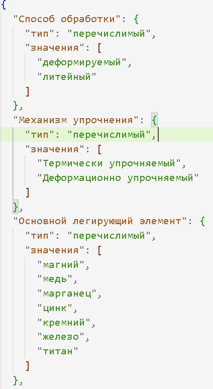

# Лабораторная работа по предмету МиТИПС

## Цель лабораторной работы
Разработать проект системы, основанную на знаниях, в которой будут присутствовать следующие компоненты: редактор знаний, решатель задач, подсистема вывода и объяснения результатов, система ввода исходных значений.

## Описание предметной области
В данной предметной области решается задача классификации сплавов алюминия. Объектом задачи является сплав алюминия. Результатом решения задачи является вид сплава алюминия. При определении вида сплава алюминия анализируются следующие значения:
- Способ обработки
- Механизм упрочнения
- Основной легирующий элемент
- Предел прочности (σ_В, МПа)
- Относительное удлинение после разрыва (δ, %)

В рамках решения задачи будет рассмотрено ограниченное множество видов сплавов алюминия. Значения свойств «Механизм упрочнения», «Основной легирующий элемент», «Способ обработки» представляют собой скалярные понятия. Свойства «Предел прочности» представляют собой целые числа. Свойство «Относительное удлинение после разрыва» представляет собой положительное вещественное число. Значения всех свойств известны на момент решения задачи.

## Проект системы, основанной на знаниях

### Архитектура системы

На вход принимаются знания ПО и исходные данные. Результатом работы системы является результат решения задачи классификации сплавов алюминия в понятном пользователю виде с обоснованием решения.
Ниже представлена архитектурно-контекстная диаграмма ИС для определения вида сплава алюминия

### Use-case диаграмма

На данной диаграмме видно, что у данной системы есть два типа пользователей:
**Эксперт.**
Эксперт может использовать систему для создания модели, то есть добавлять новые виды сплавов алюминия, и для редактирования модели, то есть редактировать свойства и виды сплавов алюминия, а также добавлять новые свойства;
**Специалист.**
У специалиста варианты использования системы — ввод исходных данных для решения задачи, их редактирование, получение результата решения задачи с объяснением.

### Проект базы данных
База данных представляет собой два json файла. Структура первого файла, для хранения информации о видах сплава, представляет собой набор пар {«ключ»: [[], [], …]}. Где «ключ» название вида сплава, а значение, хранящееся по этому ключу, представляет собой массив, в котором хранятся массивы с информацией о свойствах сплава и о значениях этих свойств для сплава.

Структура файла, для хранения информации о свойствах сплава, представляет собой набор пар {«ключ»: {«тип»: «», «значения»: []}}. Где «ключ» — это название свойства, значение, хранящееся по ключу «тип» может быть либо «перечислимый», либо «исчислимый» и оно означает тип свойства, по ключу «значения» хранятся значения свойства.

